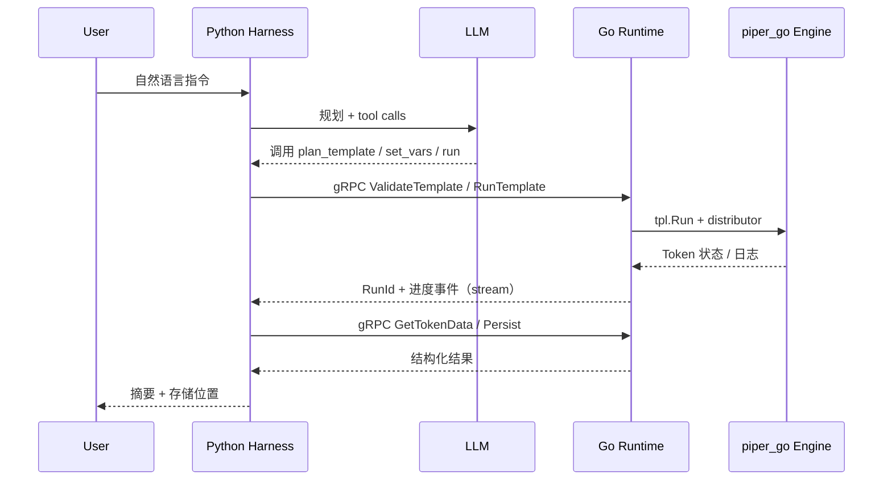

# Piper Agent 改造方案

## 1. 背景与目标

### 1.1 现状（Piper）

Piper 是一套**可配置的采集与数据处理系统**，核心链路为：

| 环节 | 现有实现 | 说明 |
|------|----------|------|
| 模版 | `Template` + `Builder` + `procedures` | JSON/YAML 形态，含 Mapper、If、For、Chrome/HTTP Action |
| 参数 | `Vars` / `vars_list` / Task 绑定 | 模版变量替换、任务批量参数 |
| 执行 | `Distributor` + `HttpAgent` / `ChromeAgent` | Token 队列、过程日志 |
| 代理 | `pkg/proxy`、MITM、账号 | 出站请求经代理池 |
| 持久化 | ES + S3（`Persister`） | Doc/Source 写入索引与对象存储 |

本仓库 `engine/`（Go 模块 `piper_go`）提供模板 HTTP/Chrome 运行、Token 队列、数据查询等采集内核能力（由 `pkg/agentruntime` 嵌入 Runtime）。

### 1.2 目标（Piper Agent）

用户用**自然语言**描述采集意图，系统应自动完成：

1. **理解意图** → 选定或生成采集模版（结构 + procedures）
2. **填参数** → 域名、URL、变量、代理策略、账号等
3. **执行** → 经代理/浏览器/HTTP 跑 Token
4. **取数** → 从 Token/Log/Mapper 产出聚合结果
5. **保存** → 写入 ES/S3 或用户指定 Sink

架构约束：**Python 实现认知型 Agent**，**Go 实现 Runtime**，二者通过 **gRPC** 通信；设计中显式引入 **Agent Harness** 与 **Runtime** 分层。

---

## 2. 可行性分析

### 2.1 结论：**可行（推荐分阶段落地）**

| 维度 | 评估 | 依据 |
|------|------|------|
| 执行层 | 高 | `piper_go/pkg/tpl`、`distributor`、`persistence` 可直接作为 Runtime 内核，避免重写模版引擎 |
| 模版生成 | 中高 | 模版为结构化 JSON；可用 LLM + Schema 约束 + 现有模版库 RAG，再经 Runtime 校验 |
| 代理与 Agent 池 | 高 | 已有 Proxy CRUD、Chrome Agent 池；Runtime 暴露「选代理 + 跑任务」RPC 即可 |
| 自然语言 | 高 | Python 生态（OpenAI/Anthropic/本地模型 + structured output / function calling）成熟 |
| 混合语言 | 高 | gRPC + protobuf 是标准方案；Go 长连接跑采集，Python 无 GIL 负担的 IO 型 Agent 循环 |
| 风险 | 中 | LLM 生成模版可能不合法 → 需 **ValidateTemplate** RPC +  dry-run；Chrome/合规与反爬需人工策略 |

### 2.2 不可行或需降级的部分

- **完全无人值守的任意网站采集**：受目标站点策略、登录态、Captcha 影响，需 Human-in-the-loop 或预置 Login 模版。
- **一次性替换 Java/Web 前端**：Agent 项目可先独立部署，通过 Runtime 调用 `piper_go` 或内嵌库，Web UI 后续再做「对话 + 任务看板」。

### 2.3 与现有代码的关系

```
┌─────────────────────────────────────────────────────────────┐
│  piper_agent (新建)                                          │
│  Python: Harness + LLM + Tools                               │
│  Go: Runtime gRPC Server + 适配层                            │
└──────────────────────────┬──────────────────────────────────┘
                           │ import / subprocess / 同进程链接
                           ▼
┌─────────────────────────────────────────────────────────────┐
│  engine/ (piper_go)                                          │
│  tpl / distributor / chrome / proxy / persistence / meta     │
└─────────────────────────────────────────────────────────────┘
```

Runtime **不重复实现** Mapper/Token 语义，而是 **编排 + 隔离 + 对外 RPC**。

---

## 3. 架构设计：Harness 与 Runtime

### 3.1 概念定义

| 概念 | 职责 | 实现语言 | 类比 |
|------|------|----------|------|
| **Agent Harness** | 会话、规划、工具注册、LLM 循环、重试策略、可观测性（trace_id） | Python | ADK / LangGraph runtime、Cursor Agent loop |
| **Runtime** | 模版校验与编译、Token 调度、Agent/Proxy 资源、持久化、配额与超时 | Go | WASM/容器 runtime，但此处是「采集执行运行时」 |
| **Tool** | Harness 可调用的原子能力（列模版、写模版、RunToken、查数据） | Python 封装 → gRPC | MCP tools 的服务端版 |
| **Worker Agent** | 专用子 Agent（TemplateAuthor、ParamFiller、Runner） | Python | 多 Agent 协作可选 |

### 3.2 端到端时序



### 3.3 gRPC 服务划分（建议）

| Service | 方法（示例） | 说明 |
|---------|--------------|------|
| `RuntimeMeta` | `ListTemplates`, `GetTemplate`, `ListProxies`, `ListIndices` | 给 LLM 上下文 |
| `RuntimeTemplate` | `ValidateTemplate`, `UpsertTemplate`, `BuildToken` | 写模版、填参、编译 Token |
| `RuntimeExecute` | `RunTemplate`, `RunTask`, `CancelRun`, `SubscribeRun` (stream) | 执行与进度 |
| `RuntimeData` | `GetTokenData`, `SearchDocs`, `ExportArtifact` | 取数 |
| `RuntimeSession` | `CreateSession`, `AppendMessage`, `GetSession` | Harness 与 Runtime 共享 run 上下文（可选） |

Proto 定义目录：`piper_agent/proto/`。

---

## 4. 技术栈

| 层次 | 技术 | 用途 |
|------|------|------|
| Agent / Harness | Python 3.11+ | 主 Agent 实现 |
| LLM 接入 | `openai` / `anthropic` / 本地 OpenAI-compatible API | 规划与生成 |
| Agent 框架（可选） | 自研轻量 Harness 或 LangGraph | 状态机、工具循环 |
| Schema | `pydantic` v2 | 工具参数与模版 DTO |
| Runtime | Go 1.22+ | 执行与资源管理 |
| RPC | gRPC + protobuf v3 | 跨语言契约 |
| Go 框架 | 标准 `google.golang.org/grpc` + 复用 `piper_go` | Server 与业务 |
| 配置 | YAML + 环境变量 | `runtime.yaml`, `agent.yaml` |
| 观测 | OpenTelemetry（可选） | trace_id 贯穿 Harness ↔ Runtime |
| 消息（可选） | Redis / NATS | 多实例 Runtime 事件总线 |
| 存储 | 沿用 Piper ES + S3 + SQLite meta | 无额外强制组件 |

---

## 5. 目录与模块说明

见仓库根下 `piper_agent/README.md` 与各子目录 `README.md`。概要：

```
piper_agent/
├── docs/                 # 方案、ADR、API 说明
├── proto/                # gRPC 契约
├── runtime/              # Go Runtime + Harness 适配（执行侧）
├── agents/               # Python Agent + Harness（认知侧）
├── shared/               # 模版 JSON Schema、示例模版
├── deploy/               # docker-compose、K8s 草稿
└── scripts/              # 代码生成、本地联调
```

---

## 6. 分阶段实施计划

### Phase A — 契约与骨架（1–2 周）

- [x] 定义 `proto/runtime/v1/*.proto`（见 `proto/`，运行说明 [PHASE_A.md](PHASE_A.md)）
- [x] Go：`runtime/cmd/piper-runtime` 启动 gRPC，**Mock** 实现 `ValidateTemplate` / `RunTemplate` / `SubscribeRun`
- [x] Python：`agents/harness` 最小 REPL + gRPC 客户端，调用 Mock
- [x] 文档：RPC 错误码约定（[RPC_ERRORS.md](RPC_ERRORS.md)）

### Phase B — 对接 piper_go（2–3 周）

- [x] Go：`piper_go/pkg/agentruntime` + `runtime/internal/piper` 调用 `Engine.RunTemplate`
- [x] 实现 `ListTemplates` / `GetTemplate`、`RunTemplate`、`GetTokenData`（见 [PHASE_B.md](PHASE_B.md)）
- [x] 配置：`piper_go_config` 与 `pipergo-api.yaml` 共用 meta/ES/H2 路径

### Phase C — LLM 写模版与填参（2–4 周）

- [x] Python tools：`template_author`, `param_filler`, `runner`（见 [PHASE_C.md](PHASE_C.md)）
- [x] RAG：索引 meta `ListTemplates` + `shared/examples/templates`
- [x] 强校验：`agentruntime.ValidateTemplate` 与 `diagnostics[].path`（如 `procedures[0].type`）

### Phase D — 代理、多 Agent、产品化（持续）

- [x] Tool：`list_proxies` / `select_proxy` → Runtime `proxy_id` + HttpAgent 绑定（见 [PHASE_D.md](PHASE_D.md)）
- [x] Chrome：`ValidateBuild` + `engine auto|chrome` + 示例模版
- [x] CLI：`piper-agent chat` + `piper-agent ask`
- [x] 审计 JSONL + 会话 Run 配额（轻量；完整 RBAC/Web UI 后续）

---

## 7. Agent Harness 设计要点（Python）

1. **SessionState**：`session_id`, `messages[]`, `pending_template`, `last_run_id`
2. **ToolRegistry**：注册 gRPC -backed tools，统一 timeout / idempotency key
3. **Loop**：`while not done: llm → tool_calls → execute → append results`（最大步数、失败回退）
4. **Policies**：禁止未 Validate 就 Run；敏感操作需用户 confirm（可选）
5. **Events**：向 UI 推送 `Planning`, `TemplateDraft`, `Running`, `Saved`

参考实现位置：`agents/harness/`。

---

## 8. Runtime 设计要点（Go）

1. **Lifecycle**：启动 → 加载 config → 初始化 `piper_go` ServiceContext / Engine → 注册 gRPC
2. **Harness 接口（执行侧）**：不是 LLM，而是「接收已结构化的 RunRequest」
3. **Concurrency**：RunId 映射到 distributor Token；Cancel 传播 context
4. **Streaming**：`SubscribeRun` 推送 Token 状态、队列深度、Proc 日志摘要
5. **Resource bounds**：最大并发 Run、Chrome Agent 数、单 Run 超时

参考实现位置：`runtime/internal/harness/`（执行编排）与 `runtime/internal/executor/`。

---

## 9. 安全与合规

- 凭证与 API Key 仅通过环境变量 / 密钥管理注入，不入库到模版 comment
- 用户指令与生成模版审计日志（可写 ES `agent_audit`）
- 默认拒绝内网 SSRF 目标（Runtime URL 白名单策略）
- 遵守目标站点 ToS；Agent 系统 prompt 中声明合法使用边界

---

## 10. 验收标准（MVP）

1. 用户输入：「抓取某 HTTPS API 的 JSON 列表字段 title、url，存到 index `articles`」
2. Harness 生成 HTTP 模版 + vars，经 Runtime **Validate** 通过
3. **RunTemplate** 成功，**GetTokenData** 返回非空 docs
4. **Persister** 可在 ES 检索到对应 index 文档
5. 全程可通过 gRPC 日志关联 `session_id` 与 `run_id`

---

## 11. 附录：自然语言 → 模版映射（示例）

用户话术中常见意图与 Runtime 动作：

| 用户意图 | Harness 行为 | Runtime RPC |
|----------|--------------|-------------|
| 「登录后抓列表」 | 选 Login 模版或生成 Chrome procedures | `ValidateTemplate`, `RunTemplate` (chrome) |
| 「用美国代理」 | 解析 proxy 过滤条件 | `ListProxies` + Token 绑定 |
| 「每天跑一次」 | 创建 Task cron（Phase D） | `UpsertTask`, `RunTask` |
| 「只要前 10 条」 | vars + For 限制 | `BuildToken` |

---

**文档版本**：v0.1  
**维护**：与 `piper_agent/proto` 及 Runtime 实现同步更新
